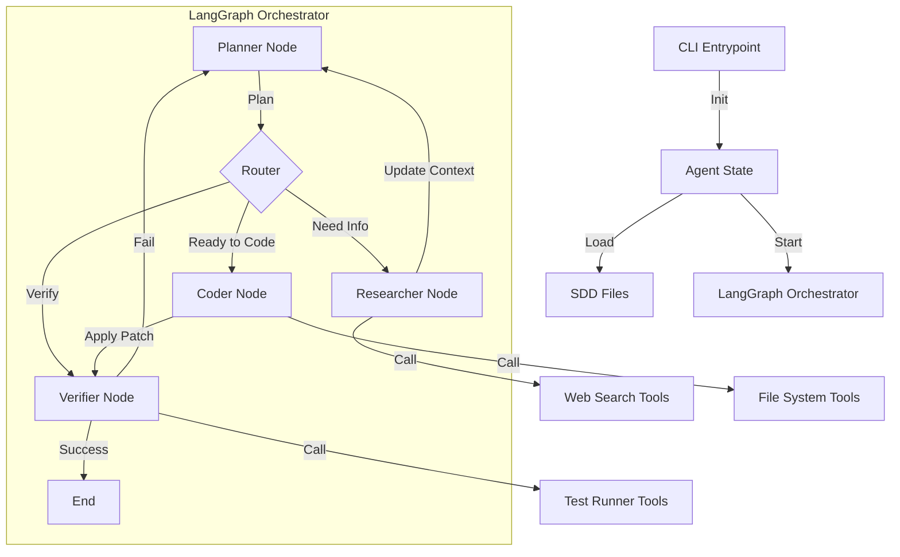

# Architect Prompt Template

Instruction for AI: based on the project description and best practices, prepare an implementation‑ready architecture specification.

Context:
- Project: kotef
- Description: # Project Description

kotef — autonomous coding & research agent that uses SDD as its “brain”.

The goal is to build a production‑grade AI coding/search agent (similar to Claude Code / Q / ChatGPT Code) that:
- plans and reasons via SDD artifacts (`project.md`, `best_practices.md`, `architect.md`, tickets);
- uses web search + focused scraping to ground decisions;
- edits real codebases with strong safety, observability, and feedback loops.

## Core
- Primary goal: turn SDD + existing search/scraping code into a reusable agentic framework for coding and deep web research on arbitrary projects.
- Users/personas: individual developer (Sasha), future team members, and automated CI bots using kotef as a coding assistant.
- Key constraints (tech, org, compliance): Node.js 20, TypeScript, LangGraph.js, OpenAI‑style tools; reuse existing code from:
  - `/Users/sasha/IdeaProjects/personal_projects/navan/root/src/tools/*`
  - `/Users/sasha/IdeaProjects/personal_projects/navan/root/src/core/deep_research.ts`
  - `/Users/sasha/IdeaProjects/personal_projects/finearts/callquest/root/src/tools/search.ts`
  - `/Users/sasha/IdeaProjects/personal_projects/tavily`
  and follow guidelines from:
  - `/Users/sasha/IdeaProjects/allthedocs/learning/research/ai_engineering/agentic_systems_building_best_practices.md`

## Definition of Done
List 5–10 concrete conditions that must be true when the project is “Done” (functional and non‑functional).
- Functional outcomes (what users can do):
  - Run kotef against a local project and have it:
    - read SDD specs (`.sdd/*`),
    - perform deep web research for missing knowledge,
    - propose and implement code changes via tools/CLI.
  - Support web search and focused content fetching using adapted Navan/Tavily components.
  - Expose a simple CLI / API to trigger research → architecture → coding loops.
- Quality attributes (performance, reliability, security, UX):
  - Respect timeouts, rate limits, and host allowlists for all web calls.
  - Never write outside the allowed project workspace; provide diffs/patches instead of blind overwrites.
  - All non‑trivial answers grounded in either repo files or web receipts (with citations).
  - Clear logs/telemetry for search, tool calls, and code edits.
- Process constraints (tests, documentation, release criteria):
  - Basic test coverage for search tools, deep research, and agent orchestration.
  - `architect.md` explicitly incorporates and cites the best‑practices doc for agentic systems.
  - Minimal “Getting Started” documentation for running kotef on a new repo.

## Non‑functional Requirements (optional)
- Performance / latency / throughput:
  - Single‑query coding session (research → plan → first edits) should typically complete within a few minutes on a small/medium repo.
  - Web search calls must enforce per‑request timeouts and limit result volume.
- Availability / reliability / SLOs:
  - Graceful degradation when web search or LLM APIs fail (clear error surfaced, no half‑applied edits).
- Security / compliance:
  - No leaking of secrets or private file contents in logs or external prompts.
  - Follow host allowlists and robots.txt behavior from the Tavily/navan projects.
- Observability / operations:
  - Structured logs for key actions (search, scraping, plan generation, code edits).
  - Hooks for future metrics integration (e.g. Prometheus / Langfuse) without hard‑coding a specific vendor.

## High-level Architecture Plan (for architect.md)
- Overall pattern: single meta‑agent with internal “SDD brain” and tool‑calling body, with an upgrade path to multi‑agent (planner / researcher / coder) if needed.
- Core subsystems to describe in `architect.md`:
  - SDD Layer:
    - Files: `.sdd/project.md`, `.sdd/best_practices.md`, `.sdd/architect.md`, `.sdd/backlog/tickets/*`.
    - Responsibility: long‑term goals, Definition of Done, coding standards, tickets and ADRs.
    - Architect spec must define how these files are loaded, validated, and updated by the agent (including Snitch/`.sdd/issues.md` loop).
  - Search & Deep Research Layer:
    - Reuse and adapt:
      - `finearts/callquest/root/src/tools/search.ts` for generic web search (Serper/Tavily/generic JSON).
      - `navan/root/src/tools/{brave_search.ts,tavily_search.ts,search.ts}` for provider‑specific search with resilience, metrics and confidence.
      - `navan/root/src/core/deep_research.ts` as the main “deep research” component (multi‑query, deduplication, synthesis).
      - Patterns from `personal_projects/tavily` (HTTP+Playwright, robots.txt, CAPTCHA handling) for safe fetching of pages discovered by search.
    - Architect spec should define:
      - Which module is the primary search tool for kotef.
      - How we choose between “shallow search” vs “deep research” for a given task.
      - Host allowlists / blocked hosts and timeouts.
  - Coding Tools Layer:
    - Abstractions for:
      - reading/writing files under a target project root (diff‑first editing, respect `.gitignore`/config);
      - running tests, linters, type‑checks via commands defined in the target project’s SDD `architect.md` (`### Commands` section);
      - generating and applying patches (git‑style hunks) safely.
    - Architect spec should outline how these tools are exposed to the LLM (OpenAI‑style tools / LangGraph.js tool nodes).
  - Orchestration Layer:
    - Implemented in Node.js / TypeScript (LangGraph.js preferred), with:
      - graph of nodes/agents (planner, researcher, coder, verifier) sharing access to SDD files and tools.
      - state object that carries current task, SDD context, intermediate research results, and code diff status.
    - Architect spec should describe:
      - node graph (states, transitions, stop conditions);
      - how Definition of Done is checked before finishing a run;
      - how feedback from runtime (test failures, spec conflicts) flows back into `.sdd/issues.md` and eventually в `.sdd/architect.md`.
  - Observability & Safety:
    - Logging of all external calls (search, scraping, LLM), including timings and outcomes.
    - Basic counters/metrics for success/failure of coding runs, search quality, and spec conflicts.
    - Guardrails for secrets, PII, and host allowlists (align with Navan/Tavily patterns and the best‑practices doc).

## Orchestrator / Agent Sketch (kotef runtime)
- Main role: glue SDD brain + tools into a single experience similar to Claude Code / Q Chat / ChatGPT Code, **while being able to synthesize that SDD brain on the fly** from a natural-language request.
- Rough structure:
  - Entry points:
    - CLI command (e.g. `kotef run --root <project-root> --goal "<task>"`) that:
      - checks whether `.sdd/` exists in the target project;
      - if `.sdd/` is missing, runs an **SDD bootstrap flow** (Research → Architect → Tickets) to create minimal SDD artifacts for the project based on the user’s goal and a light repo scan;
      - if `.sdd/` exists, loads `.sdd/*` for the target project;
      - constructs the LangGraph.js graph with configured tools (search, deep research, file I/O, test runner);
      - triggers a single “task run” (e.g. implement next ticket, fix failing tests, perform research) against the now-available SDD.
    - Optional API/daemon mode for multi‑turn sessions.
  - Agents / nodes (can initially be a single meta‑agent, but architect.md should allow splitting):
    - Bootstrap / Spec‑Builder node:
      - Given a user goal and repo snapshot, orchestrates best‑practice research and SDD synthesis.
      - Uses LLM + tools (web_search, deep_research, fs) to draft `.sdd/project.md`, `.sdd/best_practices.md`, `.sdd/architect.md`, and initial `.sdd/backlog/tickets/open/*`.
      - May reuse SDDRush prompts from `brain/` (01_research / 02_architect / 03_agent) as templates.
    - Planner node:
      - Reads `.sdd/project.md`, `.sdd/architect.md`, open tickets.
      - Decides whether to call deep research tools (Navan/Tavily) for this task.
      - Produces a short internal plan (which tools to call, which files to touch).
    - Research node:
      - Wraps `search` + `deep_research.ts` and, if needed, page‑fetch techniques from Tavily project.
      - Returns a structured summary and citations that can be written into `.sdd/best_practices.md` or used ad‑hoc for a ticket.
    - Coding node:
      - Uses SDD Agent‑prompt + tools (file read/write, tests) to apply changes.
      - Obeys Snitch protocol: on spec conflicts writes entries to `.sdd/issues.md` instead of hacking around.
    - Verifier node:
      - Runs tests/linters via commands defined in the target project’s SDD `architect.md`.
      - Decides whether Definition of Done is satisfied for the current ticket.
  - State & feedback:
    - Shared state includes:
      - initial user goal / intent (plain text);
      - whether SDD already existed or was bootstrapped in this run;
      - current ticket and status (planned / in‑progress / blocked / done);
      - research artifacts (citations, summaries, URLs);
      - code diff summaries and test results.
    - On failures:
      - Verifier or Coding node records issues in `.sdd/issues.md`.
      - Planner or Bootstrap node can request spec updates (new tickets / ADR changes) before retrying.
- Architect for kotef должен опираться на
  `/Users/sasha/IdeaProjects/allthedocs/learning/research/ai_engineering/agentic_systems_building_best_practices.md`
  при выборе паттерна (single vs multi‑agent, memory, evaluation) и явно описать этот выбор в `architect.md` (через ADR + MCDM).
- Domain: AI coding/search agent
- Tech stack: Node.js 20 / TypeScript / LangGraph.js
- Year: 2025
- Best practices: see `.sdd/best_practices.md`
- Definition of Done: see `.sdd/project.md` (section “Definition of Done”)

Operating Principles:
- Clarity first: plan → solution with brief, checkable reasoning
- MVP focus: pick minimal-sufficient solution; note scale-up path
- Verification: include tests/samples/validators
- Security: least privilege, use stack's secrets store
- Reliability: idempotency, retries with backoff+jitter, timeouts
- Cost/latency: budgets and caps; avoid over-engineering
- DoD alignment: architecture and tickets must satisfy the Definition of Done from `.sdd/project.md`.

Task:
Produce architect.md as the source of truth for implementation.

Output Structure (Markdown):
## Hard Constraints (if applicable)
- Domain-specific prohibitions (e.g., no heuristics, no regex parsers, tool-first grounding)
- Compliance requirements (GDPR, accessibility, security standards)
- Technology restrictions (no external dependencies, offline-first, etc.)

## Go/No-Go Preconditions
- Blocking prerequisites before implementation starts
- Required secrets, API keys, credentials, licenses
- Environment setup, corpora, test data availability
- Dependency readiness (external services, databases)
## Goals & Non‑Goals
- Goals: [1–5]
- Non‑Goals: [1–5]
- Link goals explicitly to the Definition of Done from `.sdd/project.md` (what must be true at release).

## Metric Profile & Strategic Risk Map
- Define a simple metric profile for this project (PerfGain, SecRisk, DevTime, Maintainability, Cost, Scalability, DX) with indicative relative weights (e.g., SecRisk 0.4, PerfGain 0.2, Cost 0.1, …).
- Summarize 3–7 strategic risks (e.g., security, test coverage, vendor lock‑in, data loss, latency/cost overruns) with High/Medium/Low ratings.
- Note how this profile should influence architecture choices (e.g., prioritize safety and maintainability in high‑risk areas even at the expense of local performance).

## Alternatives (2–3)
- A) [Name]: when to use; pros/cons; constraints
- B) [Name]: when to use; pros/cons; constraints
- C) [Optional]

## Research Conflicts & Resolutions
- Summarize key conflicting practices from `.sdd/best_practices.md` (section “Conflicting Practices & Alternatives”), including options and trade‑offs.
- For each conflict, record:
  - The chosen option and why (using the Metric Profile and project constraints/Definition of Done).
  - Links to detailed ADR entries (e.g., [ADR‑00X]).
  - Implications for components, data model, and quality attributes.

## MVP Recommendation
- MVP choice and why; scale‑up path; rollback plan

## Architecture Overview
- Diagram (text): components and connections
- Data schema (high‑level)
- External integrations

## Discovery (optional, if a repo is available)
- Map structure, entry points, integration boundaries, and cross‑cutting concerns.
- Identify dead code, high‑complexity modules, and extension points (minimal change surface).
- Output a short tree of key files and where your plan plugs in.

**Example Project Structure (if helpful):**
```
project/
├── src/
│   ├── core/
│   ├── api/
│   └── utils/
├── tests/
└── docs/
```

## MCDM for Major Choices
- Criteria: PerfGain, SecRisk, DevTime, Maintainability, Cost, Scalability, DX
- Weights: justify briefly (SMART/BWM)
- Alternatives table: scores 1–9 → normalize → TOPSIS rank
- Recommendation: pick highest closeness; note trade‑offs and rollback plan

### Decision Matrix (template)
| Alternative | PerfGain | SecRisk | DevTime | Maintainability | Cost | Scalability | DX | Notes |
|-------------|----------|---------|---------|-----------------|------|------------|----|-------|
| A           |          |         |         |                 |      |            |    |       |
| B           |          |         |         |                 |      |            |    |       |
| C           |          |         |         |                 |      |            |    |       |

## Key Decisions (ADR‑style)
- [ADR‑001] Choice with rationale (alternatives, trade‑offs)
- [ADR‑002] ...

## Components
- Component A: responsibility, interfaces, dependencies; typical flows and 3–10 key edge cases.
- Component B: ...
- For large projects, group components into domains (e.g., `.sdd/architecture/components/<area>.md`) and keep this section as a high‑level index.

## Code Standards & Conventions
### Language & Style
- Language and framework versions (LTS where possible).
- Linters/formatters (tools, config files, CI integration).
- Naming conventions (files, modules, classes, functions, tests).
- Typing rules (strictness level, `mypy`/TS config, nullability).

### Framework & Project Layout
- Folder/module conventions; separation of concerns.
- Environment configs for dev/stage/prod and local overrides.
- Where to put domain logic, adapters, scripts, and infra code.

### API & Contracts
- REST/GraphQL/gRPC style; pagination, filtering, error shapes.
- Versioning strategy (URLs/headers/schemas) and deprecation policy.
- Input/output validation (schemas, DTOs, serializers).

### Testing
- Coverage targets; required libraries and fixtures.
- Unit/Integration/E2E/Perf/Security testing strategy.
- When to stub/mocking vs. use real dependencies.

### Security
- AuthN/AuthZ patterns; scopes/roles.
- Secrets management (env vars/secret stores, never in code/logs).
- Dependency hygiene (SCA, pinning, update cadence).
- PII handling; data minimization and retention.
- SSRF/input validation/signature verification; allowlists for external domains/APIs.

### Resilience
- Explicit timeouts on all external calls (network, DB, APIs).
- Retry policies with exponential backoff + jitter, max attempts.
- Circuit breakers for fragile integrations; graceful degradation.
- Rate limiting (per-user/per-endpoint) and quotas.
- Idempotency keys for side-effects and background jobs.

### Observability
- Metrics/logs/traces; alerts and dashboards.
- Structured logging (JSON, no secrets) with correlation IDs.
- Health endpoints (e.g. `/healthz`, `/metrics`).
- Performance budgets and monitoring; key SLIs/SLOs.

### Performance & Cost
- Perf targets and cost budgets for critical paths.
- Profiling strategy and tools; when to optimize.

### Git & PR Process
- Branching model; commit style.
- Review checklists and required approvals.

### Tooling
- Formatters, linters, type checkers, security scanners.
- Pre-commit hooks and CI steps.

### Commands
Provide concrete commands for common tasks (adapt to Node.js 20 / TypeScript / LangGraph.js):
```bash
# Format code
<format-command>

# Lint
<lint-command>

# Run tests
<test-command>

# Build
<build-command>

# Type check
<typecheck-command>
```

### Anti-Patterns (Do NOT do this)
- No timeouts/retries on external calls.
- Hardcoded secrets, URLs, or configuration.
- Silent error swallowing (empty catch blocks).
- Print statements instead of structured logging.
- Missing tests for critical paths.
- No idempotency for side-effects.
- Mutable global state and circular dependencies.
- Files >400 LOC without clear separation of concerns.

### Configuration-Driven Policy
- All thresholds, limits, and environment-specific values must be configurable.
- Use environment variables or config files (never hardcode).
- Document configuration options with defaults and valid ranges.
- Validate configuration on startup.

### File Creation Policy
- Prefer in-memory operations and existing modules.
- Create new files only for substantial, reusable functionality.
- Organize by purpose (scripts/tests/utils).
- Avoid file sprawl; split large files with distinct responsibilities.

## API Contracts
- Endpoint/Function → contract (input/output, errors)
- Versioning and compatibility

## Data Model
- Models/tables: fields, keys, indexes
- Migration policies

## Quality & Operations
- Testing strategy (unit/integration/e2e/perf/security)
- Observability (metrics/logs/traces, alerts)
- Security (authn/authz, secrets, data protection)
- CI/CD (pipeline, gates, rollbacks)

## Deployment & Platform Readiness
- Target platform specifics (Lambda cold-start, container size, etc.)
- Resource constraints (memory, CPU, timeout limits)
- Bundling strategy, lazy imports, optimization
- Platform-specific packaging notes

## Verification Strategy
- When and how to verify outputs (before/after persistence)
- Verification artifacts and storage
- Auto-verification triggers and conditions
- Provenance and citation requirements

## Domain Doctrine & Grounding (optional)
- Grounding sources (DBs/APIs/files) and how to cite/verify.
- Policies & prohibitions (e.g., no heuristics for routing, scraping doctrine, robots/ToS).
- Receipts/verification discipline and provenance requirements.

## Affected Modules/Files (if repo is available)
- Files to modify → short rationale.
- Files to create → paths, responsibilities, and initial signatures.

## Technical Debt & Refactoring Backlog
- List known or expected areas of technical debt (by component/file).
- Define principles for when to create a dedicated “janitor” ticket vs. opportunistic refactoring.
- Provide 3–10 initial refactoring/cleanup tickets with priorities and rough scope.

## Implementation Steps
- Numbered, observable plan with concrete function names and signatures.
- Include timeouts, retries, validation, and error shapes.

## Backlog (Tickets)
- Break the work into tickets with clear dependencies and Definition of Done alignment.
- File structure: `.sdd/backlog/tickets/open/<nn>-<kebab>.md`
- Ticket format (each file, strongly recommended):
  - Header: `# Ticket: <nn> <short-title>`
  - Spec version: reference to this document (e.g., `Spec version: vX.Y` or commit/ADR).
  - Context: links to relevant sections in this spec (components, ADR, API contracts, quality standards).
  - Objective & DoD: what must be true when this ticket is “Done”.
  - Steps: 3–10 concrete, observable steps.
  - Affected files/modules: explicit list or patterns.
  - Tests: specific test cases and commands to run.
  - Risks & Edge Cases: known risks and important edge cases to cover.
  - Dependencies: upstream/downstream tickets.
- For recurring refactor/cleanup work, create dedicated “janitor” tickets and keep them small and focused.

## Interfaces & Contracts
- API endpoints/functions: input/output schemas, error shapes, versioning.
- Compatibility strategy and migration notes.

## Stop Rules & Preconditions
- Go/No‑Go prerequisites (secrets, corpora, env flags, licenses).
- Conditions to halt and escalate (security/compliance conflicts, blocked dependencies).

## Open Issues from Implementation
- Summarize issues reported by the Implementing Agent in `.sdd/issues.md` (conflicts, missing decisions, unclear tickets).
- For each issue, decide whether to:
  - Update this specification (and record an ADR if it is a decision).
  - Update or close the corresponding ticket(s).
  - Defer as technical debt (and create a janitor ticket).

## SLOs & Guardrails
- SLOs: latency/throughput/error rate
- Performance/Cost budgets and limits

## Implementation Checklist (adapt to project)
- [ ] All external calls have timeouts and retry policies
- [ ] Error handling covers expected failure modes
- [ ] Tests cover critical paths and edge cases
- [ ] Security requirements addressed (secrets, validation, auth)
- [ ] Observability in place (logs, metrics, traces)
- [ ] Documentation updated (API contracts, deployment notes)

## Hidden Quality Loop (internal, do not include in output)
PE2/Chain‑of‑Verification self-check (≤3 iterations):
1. Diagnose: compare the spec against Hard Constraints, Metric Profile & Strategic Risk Map, SLOs, and best_practices; identify up to 3 concrete weaknesses (missing tests/contracts, risky assumptions, perf/security gaps).
2. Refine: make minimal, surgical edits (≤60 words per iteration) to address these weaknesses without changing the overall structure.
3. Stop when saturated or when further changes would add complexity without clear benefit.

Requirements
1) No chain‑of‑thought. Provide final decisions with brief, verifiable reasoning.
2) Be specific to Node.js 20 / TypeScript / LangGraph.js and up‑to‑date for 2025; flag outdated items.

# Architect Specification: Kotef

Spec version: v1.0
Date: 2025-11-24
Status: Approved

## 1. Overview

**Kotef** is an autonomous AI coding and research agent designed to act as a "developer in a box". It uses the Spec-Driven Development (SDD) framework as its "brain" to plan, research, and execute coding tasks safely and reliably.

### Core Goals
1.  **SDD-Native**: Reads and respects `.sdd/project.md`, `.sdd/architect.md`, and tickets as the source of truth – and can **create or update** these SDD artifacts itself when they do not yet exist for a target project.
2.  **Grounded Intelligence**: Uses two-tier web research (shallow + deep) to ground decisions in up-to-date documentation and best practices.
3.  **Safe Execution**: Operates within strict safety boundaries (Node.js Permission Model, diff-first editing, path allowlists).
4.  **Observable**: Provides structured logs, traces, and human-readable run reports for every action.

## 2. Hard Constraints & Preconditions

### Hard Constraints
-   **Runtime**: Node.js 20 LTS (or higher) with `--experimental-permission` enabled.
-   **Language**: TypeScript 5.8+ (strict mode).
-   **Orchestration**: LangGraph.js for agent state machine.
-   **File Safety**: No direct file overwrites. All edits must be via unified diffs/patches.
-   **Network Safety**: Host allowlist for web search; no internal network access (SSRF protection).
-   **Secrets**: No secrets in logs or prompts. Use environment variables only.
 -   **Performance & Cost Guardrails**: Each `kotef run` must respect configurable budgets from `KotefConfig` (max wall-clock time, max tokens, max web requests). The system should prefer smaller/cheaper models for planning/research and only use top-tier frontier models (ChatGPT 5.1 / Claude Sonnet 4.5 / Gemini 3 Pro class) for final code generation or other critical steps, as defined in `.sdd/best_practices.md`.

### Preconditions
-   `OPENAI_API_KEY` (or compatible provider key) in environment.
-   Search API key (e.g., `TAVILY_API_KEY` or `SERPER_API_KEY`) for web research.
-   Target project path is provided. A `.sdd/` directory is **optional**:
    - if present, kotef loads and respects existing SDD artifacts;
    - if missing, kotef runs an internal **SDD bootstrap flow** to create minimal `.sdd/project.md`, `.sdd/best_practices.md`, `.sdd/architect.md`, and initial tickets based on the user’s natural-language request and a light repo scan.

## 3. Metric Profile & Strategic Risk Map

### Metric Profile
-   **SecRisk (0.25)**: Highest priority. Sandbox escapes or data leaks are unacceptable.
-   **Maintainability (0.20)**: Clean code, SDD adherence.
-   **DevTime (0.20)**: Use existing libraries (LangGraph, generic search).
-   **PerfGain (0.15)**: Fast enough for interactive use.
-   **Cost (0.10)**: Reasonable token usage.
-   **DX (0.10)**: Good CLI experience.

### Strategic Risks
-   **R1: Uncontrolled Edits (High)**: Agent corrupts user code. *Mitigation*: Diff-first editing, dry-run mode, Node permissions.
-   **R2: Prompt Injection (High)**: Web content tricks agent. *Mitigation*: Host allowlist, content filtering, separate research step.
-   **R3: Cost Overrun (Medium)**: Agent loops or uses expensive models. *Mitigation*: Token/step limits, budget config.

## 4. Alternatives

### Pattern A: Single-Graph Meta-Agent (Chosen for MVP)
-   **Description**: One LangGraph graph with a single "Agent" node that has access to all tools, or a simple Planner -> Executor loop.
-   **Pros**: Simpler to implement, lower latency, easier to debug initially.
-   **Cons**: Can get confused with complex tasks, harder to scale to specialized roles.
-   **Decision**: Adopt for MVP to validate core tools and safety.

### Pattern B: Multi-Node Agent Graph (Future)
-   **Description**: Distinct Planner, Researcher, Coder, Verifier agents passing state.
-   **Pros**: Better separation of concerns, specialized prompts, easier to upgrade individual components.
-   **Cons**: Higher complexity, more token usage for coordination.
-   **Decision**: Planned upgrade path once MVP is stable.

## 5. Architecture Overview

### Diagram


### Data Schema (Agent State)
-   **`messages`**: Chat history (LangChain format).
-   **`context`**: Loaded SDD content (project goals, constraints).
-   **`plan`**: Current plan steps and status.
-   **`research_results`**: List of findings with citations.
-   **`file_changes`**: List of proposed/applied patches.
-   **`test_results`**: Outcome of verification steps.

## 6. Component Specifications

### 6.1. Core & Configuration (`src/core/`)
-   **`config.ts`**: Loads env vars, parses CLI args, sets up paths. Enforces defaults (e.g., `dryRun: true`).
-   **`llm.ts`**: Adapter for LLM providers (OpenAI-compatible). Handles retries, timeouts, and structured output parsing.
-   **`logger.ts`**: Structured JSON logger.

### 6.2. Tools Layer (`src/tools/`)
-   **`fs.ts`**:
    -   `readFile(path)`: Reads file content (with size limit).
    -   `listFiles(pattern)`: Lists files respecting `.gitignore`.
    -   `writePatch(path, diff)`: Applies a unified diff. **CRITICAL**: Validates path is within workspace.
-   **`web_search.ts`**:
    -   `search(query)`: Shallow search (titles + snippets).
    -   `fetchPage(url)`: Fetches page content (text only, stripped HTML). Respects `robots.txt` and allowlist.
-   **`deep_research.ts`**:
    -   Orchestrates multi-step research: Plan Query -> Search -> Fetch -> Summarize -> Repeat if needed.
-   **`test_runner.ts`**:
    -   Executes commands from `architect.md` (e.g., `npm test`). Captures stdout/stderr.

### 6.3. Agent Layer (`src/agent/`)
-   **`state.ts`**: Defines LangGraph state schema.
-   **`graph.ts`**: Defines the nodes (Planner, Researcher, Coder, Verifier) and edges.
-   **`prompts/`**:
    -   `meta_agent.md`: Main system prompt.
    -   `planner.md`: Planning logic.
    -   `researcher.md`: Search & summarization logic.

### 6.4. CLI (`src/cli.ts`)
-   Entry point `bin/kotef`.
-   Commands:
    -   `kotef run [ticket-id]`: Execute a task.
    -   `kotef init`: Scaffold .sdd in a new project.

## 7. Code Standards & Conventions

### Language & Style
-   **TypeScript**: Strict mode, no `any` (use `unknown` + validation).
-   **Linting**: ESLint + Prettier.
-   **Testing**: Node.js built-in runner (`node:test`).

### Security
-   **Path Validation**: All FS tools must use `resolvePath` which throws if path is outside root.
-   **Network**: No direct `fetch` in agent logic; must use `web_search` tool which enforces allowlist.
-   **Secrets**: Never log env vars. Redact likely keys (regex) from logs.

### Observability
-   **Logs**: JSON format to stdout/file.
    -   `{"level": "info", "component": "agent", "event": "tool_call", "tool": "read_file", ...}`
-   **Run Report**: Markdown summary generated at `.sdd/runs/YYYY-MM-DD_HH-MM-SS_run-id.md`.

## 8. Implementation Plan (Tickets)

See `.sdd/backlog/tickets/open/` for detailed tickets.

1.  **01-scaffold-core**: Project setup, config, LLM adapter.
2.  **02-tools-fs**: Safe file system tools.
3.  **03-tools-search**: Web search & deep research.
4.  **04-agent-graph**: LangGraph orchestration.
5.  **05-cli-entrypoint**: CLI & logging.
6.  **06-evaluation**: E2E tests & CI.

## 9. Decision Log (ADRs)

### ADR-001: LangGraph.js for Orchestration
-   **Context**: Need a stateful, graph-based agent framework.
-   **Decision**: Use LangGraph.js.
-   **Rationale**: Native TypeScript support, strong state management, fits the "graph of nodes" mental model better than linear chains.

### ADR-002: Node.js Permission Model
-   **Context**: Need to prevent agent from accessing sensitive system files.
-   **Decision**: Use `--experimental-permission` flags.
-   **Rationale**: Provides OS-level enforcement of sandbox, reducing risk of code bugs allowing escapes.

### ADR-003: Diff-First Editing
-   **Context**: Direct file overwrites are risky and hard to review.
-   **Decision**: Agent must generate unified diffs.
-   **Rationale**: Diffs are human-readable, reversible, and standard for code changes.

## 9. Brain, Body & Ticket Lifecycle

### 9.1. Brain vs Body Architecture

Kotef separates concerns into two layers:

#### Brain (Immutable Templates)
-   **Location**: `brain/templates/`
-   **Purpose**: Reusable, immutable SDDRush template prompts for generating SDD artifacts.
-   **Files**:
    -   `01_research.md`: Research prompt template
    -   `02_architect.md`: Architect prompt template
    -   `03_agent.md`: Agent prompt template
    -   `04_ticket.md`: Ticket template
-   **Responsibility**: Provide consistent, best-practice-based starting points for any project.

#### Body (Runtime Agent)
-   **Location**: `src/agent/`
-   **Purpose**: Execute tasks based on SDD specifications.
-   **Components**:
    -   `graphs/sdd_orchestrator.ts`: Orchestrates SDD bootstrap (Research → Architect → Tickets)
    -   `nodes/`: Planner, Coder, Verifier, Researcher nodes
    -   `tools/`: File I/O, web search, test runner

#### Project SDD (Mutable, Project-Specific)
-   **Location**: `.sdd/` in each target project
-   **Files**:
    -   `project.md`: Project description, DoD
    -   `best_practices.md`: Research-backed patterns
    -   `architect.md`: Architecture specification
    -   `backlog/tickets/open/*.md`: Open tickets
    -   `backlog/tickets/closed/*.md`: Closed tickets
    -   `issues.md`: Snitch-reported issues
-   **Responsibility**: Serve as authoritative spec for the target project.

### 9.2. Orchestrator Behavior

**When `.sdd/` is missing (bootstrap mode)**:
1.  Run SDD bootstrap flow: Research → Best Practices → Architect → Tickets
2.  Use `brain/templates/` to generate initial SDD artifacts
3.  Write `.sdd/project.md`, `.sdd/best_practices.md`, `.sdd/architect.md`, and initial `.sdd/backlog/tickets/open/*.md`

**When `.sdd/` exists (normal mode)**:
1.  Load existing `.sdd/project.md`, `.sdd/architect.md`, `.sdd/best_practices.md`
2.  Summarize for agent context (via `state.sddSummaries`)
3.  **Never overwrite** existing SDD files
4.  Only append to `.sdd/issues.md` or create new tickets in `.sdd/backlog/tickets/open/`

**Reseed option**:
-   CLI flag `--reseed-sdd` allows full regeneration when user explicitly requests a reset

### 9.3. Ticket Lifecycle

**Ticket States**:
-   `open`: Ticket is planned or in progress → `backlog/tickets/open/*.md`
-   `closed`: Ticket is complete → `backlog/tickets/closed/*.md`

**Ticket Flow**:
1.  **Creation**:
    -   Bootstrap: `sdd_orchestrator.ts` generates initial tickets in `open/`
    -   Follow-up: Planner or Snitch creates new tickets in `open/` when discovering out-of-scope work
2.  **In Progress**:
    -   Planner sets `state.sdd.ticketPath` and `state.sdd.ticketId` when starting work on a ticket
    -   Coder, Verifier reference ticket via `state.sdd.ticket` (markdown content) and `ticketPath`
3.  **Completion**:
    -   When Planner decides `done=true`, `ticket_closer.ts` moves ticket from `open/` to `closed/`
    -   Ticket file is moved (not deleted), preserving history

**Follow-Up Ticket Creation**:
-   **When**: Planner or Verifier identifies work beyond current ticket scope (e.g., global test failures, tech debt)
-   **How**:
    -   Create new ticket file in `open/` with format `NN-kebab-slug.md`
    -   Populate with ticket template (Objective, DoD, Steps, Affected Files, Tests, Risks, Dependencies)
    -   Link to relevant SDD sections (architect, best_practices)
-   **Notes**: Prevents unbounded scope creep by deferring out-of-scope work to explicit tickets

### 9.4. Run Report ↔ Ticket Linkage

Run reports (`.sdd/runs/*.md`) include:
-   `ticketId`: Identifier of the ticket worked on (e.g., `17-goal-aware-verification`)
-   `ticketPath`: Absolute path to ticket file (open or closed)
-   `ticketStatus`: Whether ticket was closed or still open after this run
-   `followUpTickets`: List of any new tickets created during this run

This enables traceability: which runs worked on which tickets, and which runs spawned new work.


### 10.1. Stack Detection & Default Commands
The agent automatically detects the project stack and infers preferred verification commands. This logic is implemented in `src/agent/utils/verification.ts`.

| Stack | Detection Signals | Primary Test | Smoke Test | Build Command |
|-------|-------------------|--------------|------------|---------------|
| **Node/TS** | `package.json` | `npm test` | `npm run dev` (if present) | `npm run build` |
| **Vite** | `vite.config.*` | `npm test` | `npm run dev` | `npm run build` |
| **Python** | `pyproject.toml`, `requirements.txt`, `*.py` | `pytest` | `python app.py` | N/A |
| **Go** | `go.mod`, `*.go` | `go test ./...` | `go run .` | `go build` |

### 10.2. Goal-Aware Command Selection
The `verifierNode` selects commands based on the **User Goal** and **Execution Profile**:

1.  **Goal Relevance**:
    *   If goal mentions specific files (e.g., "fix `utils.ts`"), prefer tests targeting those files.
    *   If goal is "fix build", prioritize `build` command.
    *   If goal is "fix import error", prioritize `smoke` or `build`.

2.  **Profile-Based Selection**:
    *   **`strict`**: Run **Primary Test** + **Build** + **Linters**. All must pass.
    *   **`fast`**: Run **Primary Test** (or targeted subset).
    *   **`smoke`**: Run **Smoke Test** only (or manual verification).
    *   **`yolo`**: Run **Smoke Test** only. If it runs, it's good.

### 10.3. Failure Classification
Failures are classified to avoid blocking on out-of-scope issues:
*   **Blocking**: Failure in modified files or directly related to the goal.
*   **Out-of-Scope**: Pre-existing failure in unrelated files (verified by checking baseline or logs).
*   **Partial Success**: Goal is met (functional verification passes), but global suite has unrelated failures.

### 10.4. Verification Artifacts
*   **Run Report**: Records detected stack, selected commands, and pass/fail status.
*   **Issues Log**: Out-of-scope failures are logged to `.sdd/issues.md` for future tickets.

## 11. Goal-First DoD & Execution Profiles

### Philosophy
Kotef's Definition of Done is **profile-sensitive**: we distinguish between **functional success** (the core goal works) and **quality hardening** (all linters, coverage, and secondary checks pass). Different profiles allow different trade-offs between speed and exhaustive quality gates.

### Profile-Specific Quality Gates

| Profile  | Core Tests | Coverage  | Linters/Type-Check  | Behavior                                                                                           |
|----------|------------|-----------|---------------------|----------------------------------------------------------------------------------------------------|
| `strict` | **HARD**   | **HARD** ≥90% | **HARD**            | All quality gates must pass. No compromises. Suitable for production code, security-critical work. |
| `fast`   | **HARD**   | Soft (best-effort) | Soft (best-effort) | Core functional tests must pass. Coverage/linters are attempted but not blocking after N retries.  |
| `smoke`  | Minimal    | N/A       | N/A                 | Only basic smoke test or manual verification required. No hard gates for automated quality checks. |
| `yolo`   | Functional-first | N/A | N/A                 | If the app runs and core interactions work, stop after bounded attempts even if some tests fail. Document remaining issues.|

### Functional Success Criteria
For profiles `fast` and `yolo`, we define "functionally done" as:
1. **Core goal met**: The primary user-facing functionality works (e.g., app starts, key feature executes without crash).
2. **No critical failures**: No security vulnerabilities, no data corruption, no crashes in happy path.
3. **Bounded effort**: After `MAX_GOAL_FIRST_ATTEMPTS` (default: 3) fix cycles, remaining issues are non-critical (lint warnings, coverage gaps, edge-case test failures).

### When to Mark as Done in Non-Strict Profiles
The `verifierNode` and `plannerNode` use the following logic:

- **strict**: `done = (all tests pass AND coverage ≥ 90% AND no lint errors)`
- **fast**: `done = (core tests pass) OR (functionalOk AND attempts >= 3 AND remaining failures are non-critical)`
- **smoke**: `done = (basic smoke test passes OR manual verification confirmed)`
- **yolo**: `done = (functionalOk AND attempts >= 2) OR (all tests pass)`

Where:
- `functionalOk`: Derived from successful execution of run commands (e.g., `npm start`, `python app.py`) or explicit functional probes.
- `non-critical failures`: Lint warnings, coverage gaps, type errors in non-core paths, flaky E2E tests.
- `critical failures`: Runtime crashes, failing core unit tests, security vulnerabilities.

### Implementation Notes
- The `verifierNode` tracks attempts via `state.failureHistory.length`.
- The `plannerNode` decides `next="done"` when functional success criteria are met, even if `testResults.passed` is false.
- Run reports include:
  - Profile used (`strict`/`fast`/`smoke`/`yolo`)
  - Whether run was marked "functionally done with remaining issues"
  - List of remaining test failures/lint errors (if any)
- This allows pragmatic, time-boxed completion for rapid prototyping and iterative development, while maintaining strict quality gates for production code.

### Trade-offs & Risks
- **Risk**: Overly permissive logic may accept runs with serious bugs.
  - **Mitigation**: Conservative classification of "critical vs non-critical" failures. Security scans and crash tests are always critical.
- **Risk**: Users may deploy "functionally done" code without addressing remaining issues.
  - **Mitigation**: Run reports clearly document remaining issues. CI pipelines can enforce `strict` profile for merge/deploy.

---
