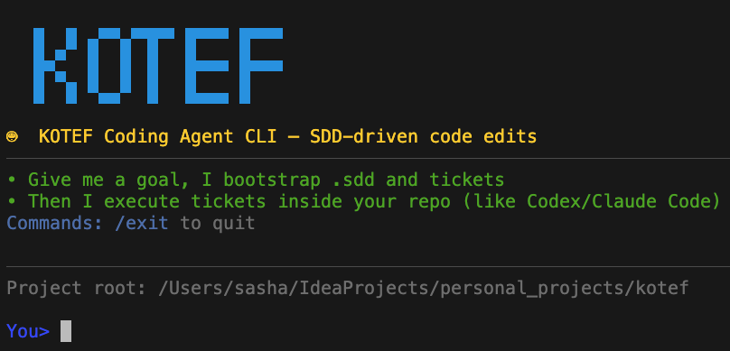

<div align="center">

# kotef — Your AI Architect & Tech Lead

_heb. 'kotef' (קוטף) — 'one who picks/harvests' (wordplay with 'katef' כתף — 'a shoulder to support you')_

> "Give me a repo and a goal. I'll research, plan, and document everything — then code it safely."



</div>

**Not another AI code editor.** Kotef is an autonomous **SDD Brain** — it researches best practices, creates architecture specs, generates tickets, and only then writes code. Think of it as an Architect + Tech Lead in a CLI.

<table>
<tr>
<td>🧠</td>
<td><strong>SDD Brain</strong><br/><sub>Creates project.md, architect.md, best_practices.md, tickets</sub></td>
</tr>
<tr>
<td>🔍</td>
<td><strong>Deep Research</strong><br/><sub>Quality-scored web research with citations</sub></td>
</tr>
<tr>
<td>📋</td>
<td><strong>Intent Contracts</strong><br/><sub>Explicit constraints, DoD, forbidden paths</sub></td>
</tr>
<tr>
<td>🛡️</td>
<td><strong>Verification Loop</strong><br/><sub>Tests changes before committing</sub></td>
</tr>
</table>

---

## What makes kotef different

| Other AI Coders | Kotef |
|-----------------|-------|
| Jump straight to code | Research → Architecture → Tickets → Code |
| Hallucinate APIs | Ground decisions in fresh web research |
| Ignore your patterns | Read and respect your codebase |
| Leave uncommitted mess | Auto-commit per feature with verification |
| Forget context between runs | Project memory + research cache |

**Kotef's unique value:** It's not trying to be an IDE. It's a **brain** that does the thinking (research, architecture, planning) so you can focus on reviewing and shipping.

---

## 🚀 Quick Start

```bash
# 1. Configure environment
cp .env.example .env
# Edit .env with your API keys

# 2. Install & build
npm install && npm run build

# 3. Run
node bin/kotef run --root /path/to/repo --goal "Add user login feature"
```

**Interactive mode:**
```bash
node bin/kotef chat --root /path/to/repo
```

---

## How it works

```
┌─────────────────────────────────────────────────────────────┐
│                        SDD BRAIN                            │
│  Creates .sdd/ folder with:                                 │
│  • project.md — goals, constraints, DoD                     │
│  • architect.md — architecture decisions                    │
│  • best_practices.md — research-backed patterns             │
│  • backlog/tickets/ — implementation tasks                  │
│  • KOTEF.md — project-level policies                        │
└─────────────────────────────────────────────────────────────┘
                              ↓
┌─────────────────────────────────────────────────────────────┐
│                      RUNTIME FLOW                           │
│  planner → researcher → coder → verifier → ticket_closer    │
│                                                             │
│  • Intent Contract enforces constraints                     │
│  • Research cache avoids duplicate web calls                │
│  • Project memory learns from past runs                     │
└─────────────────────────────────────────────────────────────┘
```

**Tech:** Node.js + TypeScript + LangGraph, deep web research with quality scoring, LSP diagnostics, git integration, execution profiles (`strict`/`fast`/`smoke`/`yolo`).

---

## Perfect for

- **Solo devs** shipping features fast
- **Tech leads** delegating implementation
- **Teams** handling ticket backlogs
- **Anyone** tired of AI that guesses wrong

---

## Contributing

High-impact areas: smarter research, better planning, bulletproof verification.

Found a bug? Open an issue. Have an idea? Start a discussion. Want to code? Check `.sdd/backlog/tickets/`.

See `CONTRIBUTING.md` for details.

---

## License

Apache 2.0 — see [LICENSE](./LICENSE).
