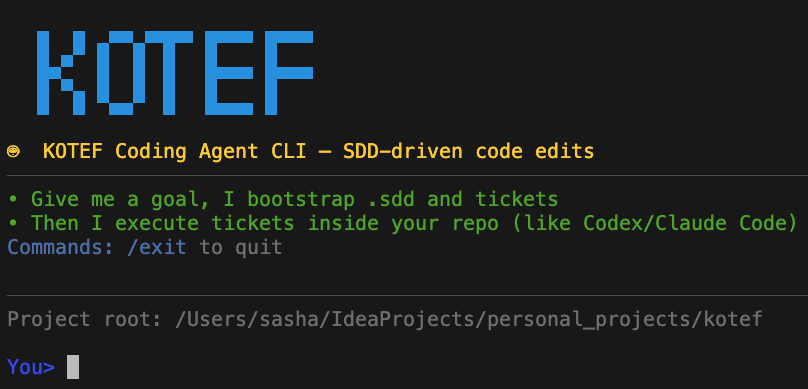

<div align="center">

# kotef

_A durable frontier coding and research agent for spec-driven delivery._



</div>

Kotef is no longer just an "SDD brain". It is a 2026-style agent runtime built around:

- `OpenAI Responses` as the primary model runtime
- `LangGraph` durable execution with persistent thread checkpoints
- `MCP` as a context plane for tools, prompts, and resources
- an agent-first SDD workflow with machine-readable ticket generation
- backlog v2 at `.sdd/backlog/open/` and `.sdd/backlog/closed/`

## Quick Start

```bash
cp .env.example .env
npm install
npm run build

node bin/kotef run \
  --root /path/to/repo \
  --goal "Add user login with minimal surface area"
```

Interactive mode still exists:

```bash
node bin/kotef chat --root /path/to/repo
```

## Durable Workflow

Run with an explicit thread:

```bash
node bin/kotef run --root /path/to/repo --thread auth-login --approval-mode human-gate
```

Resume after an interrupt:

```bash
node bin/kotef resume auth-login --root /path/to/repo
```

Inspect run state and checkpoint history:

```bash
node bin/kotef inspect run auth-login --root /path/to/repo
```

## MCP and Migration

Inspect MCP server health and capabilities:

```bash
node bin/kotef mcp doctor --root /path/to/repo
```

Migrate legacy SDD backlog layout into backlog v2:

```bash
node bin/kotef migrate sdd --root /path/to/repo
```

Run the eval harness:

```bash
node bin/kotef eval --root /path/to/repo
```

## Runtime Model

Kotef uses a supervisor graph:

1. `approval_gate`
2. `planner`
3. `researcher`
4. `coder`
5. `verifier`
6. `janitor`
7. `ticket_closer`
8. `retrospective`

Each run is checkpointed into `.sdd/runtime/kotef.sqlite` and emits JSONL events under `.sdd/runtime/events/`. MCP snapshots are cached under `.sdd/context/mcp/`.

## SDD 2.0 Flow

Kotef expects and maintains:

- `.sdd/project.md`
- `.sdd/architect.md`
- `.sdd/best_practices.md`
- `.sdd/backlog/open/*.md`
- `.sdd/backlog/closed/*.md`

The brain prompts are XML-structured and agent-first:

- `understand_and_design` emits best practices plus architect spec
- `plan_work` emits machine-readable XML tickets
- runtime prompts assume direct file access, tool access, MCP context, and resumable execution

## Positioning

Kotef is optimized for teams that want:

- spec-first execution instead of one-shot codegen
- grounded coding with fresh research and MCP context
- durable, resumable runs instead of fragile single sessions
- explicit ADRs, assumptions, verification, and cleanup signals

## Development

```bash
npm run build
npm test
```

License: Apache-2.0.
